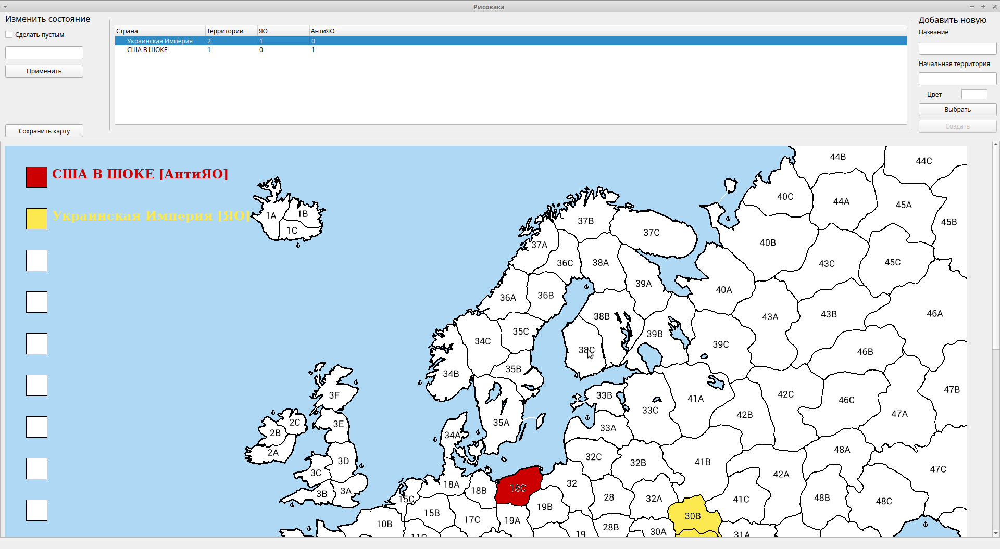

# Risovaka
*The English translation is coming soon*

Программа для упрощения работы ОПа в тредах типа "Захвати Х тред" на этих ваших имиджбордах.

*Инструкция*:
Если игра начинается в Европе, выбери в качестве конфига europe.json из базовой поставки. Если нет, запусти конфигуратор и сделай json для своей карты (порты отмечаешь галкой, для закраски - двойной клик).
Добавлять страны в правом меню, а регистрировать захваты - в левом. Территории для захвата указывай через пробел.

*Пока что возможны баги/лаги/вылеты, прошу в случае чего делать жалобы в ~~прокуратуру~~ багтрекер на GitHub.*

*Сборка:*
Нужны `Pillow` и `PyQt5`, проверял с Python 3.7 и 3.8. Скрипт для сборки под виндой в MSYS2 `mingw-w64_build.bash`. Бинарные сборки для Windows упаковываются InnoSetup, для Linux/MacOS добавлю если будет спрос.

Отблагодарить биткоином можно сюда: *bc1q9032dmxwpgjq08tvtnnkf5t50k0haf5asl73p8*
Если накидают 0.001 BTC, допилю программу до состояния, при котором она полностью заменит ОПа: будет парсить посты и выкладывать карту сама.

## License: GPLv3

Пик взял у shkolnick-kun c linux.org.ru 
Под BuguRTOS не собирается т.к. там Qt не работает :)
